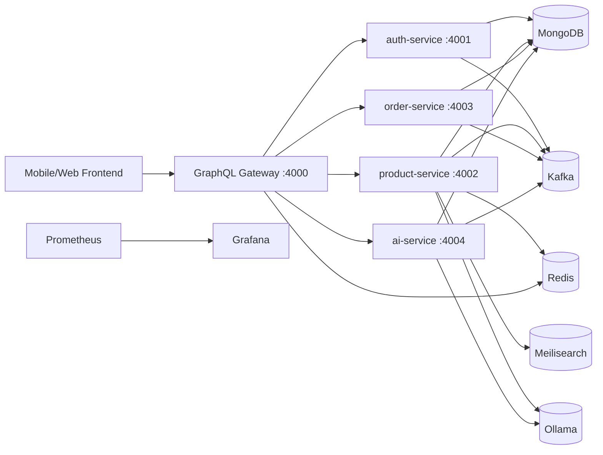

# E-commerce Backend (Microservices)

Production-ready backend for a multi-role e-commerce app with:
- GraphQL gateway
- Auth, Product, Order, and AI services
- Kafka event flow + Saga-style order/stock coordination
- Redis-backed distributed runtime features
- Meilisearch suggestions and Ollama-based semantic retrieval
- Prometheus + Grafana monitoring

## Architecture



## Core Features

### 1) Security and Gateway
- Central GraphQL gateway with schema stitching.
- JWT-based auth verification through auth-service.
- Redis-backed rate limiting in gateway (`GATEWAY_REDIS_URL`).
- Idempotency middleware for mutation safety.
- Circuit breakers for downstream services.
- Correlation IDs for traceability.

### 2) Auth Service
- Register / login / refresh / logout.
- Profile management.
- Address book management.
- Token verification for internal service usage.

### 3) Product Service
- Product + variant catalog management.
- Multi-filter search (`search`, category/categories, price range, stock-only, sort).
- Search suggestions:
  - Primary: Meilisearch
  - Fallback: MongoDB strategy
- Semantic product search via embeddings (Ollama provider).
- Inventory reservation / deduction / restore flows.
- Cache-aside with TTL jitter + singleflight deduplication.

### 4) Order Service
- Cart operations.
- Checkout and order lifecycle.
- Order cancellation and status updates.
- Seller analytics (`sellerAnalytics`) with trend points and order-status mix.
- Saga coordinator integration for order workflows.

### 5) AI Service
- Personalized recommendations.
- Similar products with hybrid scoring:
  - embedding signal
  - category similarity
  - co-purchase signal
  - popularity/trending signal
- Chat shopping assistant with:
  - intent parsing
  - retrieval + filtering
  - safety handling
  - structured model response parsing

### 6) Observability
- `/health` endpoint per service.
- `/metrics` endpoint per service (Prometheus format).
- Grafana dashboards with Prometheus datasource.

## Repo Structure

```text
auth-service/
product-service/
order-service/
ai-service/
graphql-gateway/
shared/                   # shared kafka/metrics/saga utilities
monitoring/               # prometheus + grafana provisioning
scripts/                  # EC2 deploy pipeline scripts
docker-compose.yml        # local infra
docker-compose.prod.yml   # full production-like stack
```

## Prerequisites

- Docker + Docker Compose
- Node.js 18+
- npm

## Run Locally

### Option A: Infra in Docker + services with npm (fast dev loop)

Start infra:

```bash
docker compose up -d
```

This starts: Zookeeper, Kafka, Kafka UI, MongoDB, Redis, Meilisearch, Ollama.

Then start services in separate terminals:

```bash
cd auth-service && npm start
cd product-service && npm start
cd order-service && npm start
cd ai-service && npm start
cd graphql-gateway && npm start
```

### Option B: Full stack in Docker (production-like)

```bash
docker compose -f docker-compose.prod.yml up -d --build
```

## Service Endpoints

- Gateway GraphQL: `http://localhost:4000/graphql`
- Gateway Health: `http://localhost:4000/health`
- Auth Health: `http://localhost:4001/health`
- Product Health: `http://localhost:4002/health`
- Order Health: `http://localhost:4003/health`
- AI Health: `http://localhost:4004/health`

Metrics:
- Gateway: `http://localhost:4000/metrics`
- Auth: `http://localhost:4001/metrics`
- Product: `http://localhost:4002/metrics`
- Order: `http://localhost:4003/metrics`
- AI: `http://localhost:4004/metrics`

Infra UIs:
- Kafka UI: `http://localhost:8080` (local compose)
- Prometheus: `http://localhost:9090` (prod compose)
- Grafana: `http://localhost:3000` (prod compose)
- Meilisearch: `http://localhost:7700`

## Environment Variables

Minimum required for production deploy:
- `JWT_SECRET`
- `JWT_REFRESH_SECRET`
- `INTERNAL_JWT_SECRET`
- `GEMINI_API_KEY`

Search/semantic related:
- `PRODUCT_SEARCH_ENGINE_ENABLED=true|false`
- `PRODUCT_SEARCH_ENGINE_TYPE=meilisearch`
- `MEILI_HOST=http://meilisearch:7700`
- `MEILI_MASTER_KEY=<meili-master-key>`
- `MEILI_INDEX_NAME=products`
- `SEARCH_SEMANTIC_ENABLED=true|false`
- `OLLAMA_EMBED_MODEL=embeddinggemma`

Redis:
- `GATEWAY_REDIS_URL=redis://redis:6379` (or host URL)
- `PRODUCT_REDIS_URL=redis://redis:6379` (or host URL)

## Reindex Commands

Semantic index (product-service):

```bash
cd product-service
npm run search:reindex
```

AI semantic catalog:

```bash
cd ai-service
npm run semantic:reindex
```

Dedicated search engine index:

```bash
cd product-service
node scripts/reindexSearchEngine.js
```

## CI/CD

### CI (`.github/workflows/ci.yml`)
- Builds Docker images for all services.
- No test stage currently (build verification only).

### CD (`.github/workflows/deploy.yml`)
- SSH to EC2.
- Pull latest branch.
- Load secrets/vars.
- Run deploy pipeline via `scripts/deploy.sh`.
- Health-check gateway.
- Initialize AI stack:
  - Ollama model pull
  - Semantic reindex
  - Dedicated search reindex (Meilisearch)

Required GitHub Secrets:
- `EC2_HOST`, `EC2_USER`, `EC2_SSH_KEY`
- `JWT_SECRET`, `JWT_REFRESH_SECRET`, `INTERNAL_JWT_SECRET`
- `GEMINI_API_KEY`
- `MEILI_MASTER_KEY` (required when `PRODUCT_SEARCH_ENGINE_ENABLED=true`)

Recommended GitHub Variables:
- `PRODUCT_SEARCH_ENGINE_ENABLED`
- `SEARCH_SEMANTIC_ENABLED`
- `OLLAMA_EMBED_MODEL`

## Notes

- Internal service GraphQL endpoints are protected using `x-internal-gateway-token`.
- Prefer routing client GraphQL traffic through gateway only.
- CI may pass while runtime still fails if secrets/env/infra are misconfigured.
